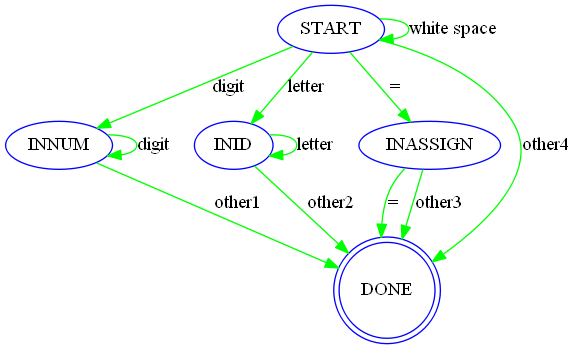
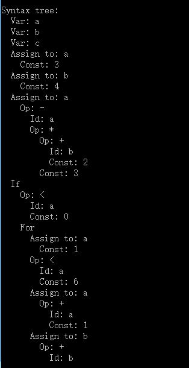

编译器实现报告
============

**使用方式及支持语法见`README.pdf`**

>##前言

###整体设计
总体流程，`词法分析 -> 语法分析及语法树构建 -> 符号表构建 -> 生成汇编代码`。词法分析采用构造DFA的思想来写；语法分析用递归下降的方法；最终根据语法树生成X86汇编代码，在生成代码时。为了保证寄存器不冲突，主要采用入栈出栈的方法来保存变量，所以代码冗余度高，效率不高。

##1、词法分析
>主要程序所在文件：`scan.cpp`

### **DFA结构**

START：开始状态	DONE：结束状态	INNUM：为数字		INID：为字母		INSSIGN：赋值状态

other1:非数字	other2：非字母	other3：非`=`的字符	other4：所有未被识别的字符，包括{`<`，`>`，`{`，`}`，`;`，`+`，`-`，`*`，`/`}

### **token定义**

	typedef enum
	{ENDFILE,ERROR,
    /* 保留字 */
    IF,ELSE,FOR,WHILE,INT,CHAR,
    /* 标识符和数字 */
    ID,NUM,
    /* 特殊标识符 */
    ASSIGN,EQ,LT,PLUS,MINUS,MUL,DIV,LPAREN,RPAREN,LBRACE,RBRACE,SEMI
	} TokenType;

### **识别过程**

根据DFA状态机指示一步一步识别，用currenttoken保存当前token状态，且当识别为other1，other2，other3时需要后退一个字符；当结束状态curentoken=INID时，要进一步判断是否为保留字{int，char，bool，if，for，while}。

>注：词法识别主要在语法识别中被调用，通过识别的token一步一步构建语法树

##2、语法分析
>主要程序所在文件：`parse.cpp`

### **把BNF文法转化为EBNF**
EBNF文法

	statement_list  -> statement{ statement} //开始语句
	statement  -> expression| if_stmt| while_stmt|for_stmt|var_stmt|assign_stmt //判断是哪一个语句
	if_stmt -> IF '(' expression ')' '{'statement_list'}' [ELSE '{'statement_list'}'] //if语句
	for_stmt -> FOR '('expression';'expression';'expression')''{'statement_list'}' //for语句
	while_stmt -> WHILE '(' expression ')' '{'statement_list'}' //while语句
	assign_stmt -> ID = expression //表达式语句
	var_declaration -> type_specifer ID ';' //赋值语句
	expression -> simple_expression [relop simple_expression] //比较表达式
	simple_expression -> term [addop simple_expression] //表达式（+，-）运算
	term -> factor [mulop term] //表达式 * 运算
	factor -> NUM |ID |'('expression')' //数字或字母
### **语法树数据结构的定义**
>语法树中只存`expression| if_stmt| while_stmt|for_stmt|var_stmt|assign_stmt`语句的属性，不存`( ) { } ;`这些符号，并用`match()`函数跳过这些token

树的节点

	typedef struct treeNode
	{ struct treeNode * child[MAXCHILDREN];
     struct treeNode * sibling; //下一条语句
     int lineno;
     NodeKind nodekind;
     union { StmtKind stmt; ExpKind exp;} kind;
     union { TokenType op;
             int val;
             char * name; } attr;
     ExpType type; /* 算数表达式值类型 */
	} TreeNode;
`MAXCHILDREN`根据for语句可知最多有4个子节点，定义为4

`sibling`用于一个完整语句的后继语句`expression| if_stmt| while_stmt|for_stmt|var_stmt|assign_stmt`，其后继是哪一个语句，只会在`statement_list  -> statement{ statement} //开始语句`，中出现

节点分类

	typedef enum {StmtK,ExpK} NodeKind; //节点类型，语句或算术表达式
	typedef enum {IfK,ForK,WhileK,AssignK,Vark} StmtKind; //语句类型
	typedef enum {OpK,ConstK,IdK} ExpKind; //算数表达式类型

### **语法树构建方法**
用递归下降的方法，递归是关键，详细程序结构参见`parse.cpp`文件

根据样例程序生成的语法树：

>注：语法分析只是生成一个语法树，供后续的符号表分析构建，生成X86汇编使用

## 3、构建符号表
### **构建符号表之前进行类型检查**
`if`语句中为`bool`型，若为`int`型则当作`bool`型处理；`for`中三个参数分别为`int`，`while`中为`bool`型，若为`int`型则当作`bool`型处理。

符号检查函数：
`static void checkNode(TreeNode * t)`，通过函数

	static void traverse( TreeNode * t, 
	void (* preProc) (TreeNode *),
	void (* postProc) (TreeNode *) )
进行遍历整棵树，这里用到了函数指针，把checkNode()，函数作为第二个指针，而第一个仅需要传进去一个返回函数即可。
### **符号表内容**
通过遍历语法树建立符号表
通过函数`static void insertNode( TreeNode * t)`一步一步地向hash表中插入符号，这里也要通过traverse()，函数遍历整棵树，不同的是要把insertNode()作为第一个函数指针传进去。

建立的符号表如下：

表中详细记录了每个符号出现的次序及其出现的行号

##4、X86汇编的生成
>通过遍历语法树，一步一步针对不同的语句生成汇编代码。主要代码位于`asmCode.cpp`

### **条件语句**
条件语句生成汇编，位于函数`static void genStmt(TreeNode * tree)`

这里主要是对lable的管理，防止lable错乱，生成了一个全局变量jLable，没用到一次用一个局部变量，jLable1或jLable2对其加1，可有效防止lable错乱
### **算式语句**
算式计算语句生成汇编，位于函数`static void genExp(TreeNode * tree)`

这里主要是对多重算式的计算及其中寄存器的管理，这里为了方便只使用了EAX和EBX两个寄存器，为了不对其造成冲突，每使用一个用一个标志位fa或fb表示已经用过了，每存入一个改变标志位。

